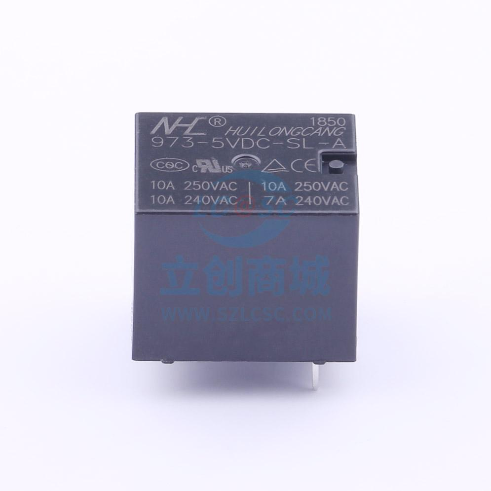
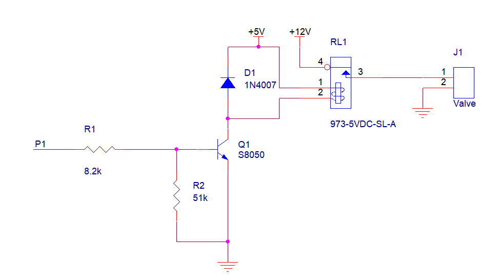

#控制驱动电路设计
##修改历史
|版本|日期|说明|作者|
|----|----|----|----|
|V1.0|2022年4月10日|创建控制驱动电路设计|马博阳|
|V1.1|2022年4月11日|修改线圈电压，添加器件配图|马博阳|
##设计需求
1. 继电器线圈电压5V；
2. 使用单片机GPIO控制继电器；
3. 可以在浴室环境下正常工作。

##器件选择
由于需要控制照明、通风和电磁阀，继电器需要能够切换220V交流电或12V直流电，能够承受1A电流，线圈供电电压5V，选择`973-5VDC-SL-A`。

##控制驱动电路设计
继电器自身所需的电流和电压大于单片机GPIO所能提供的电流和电压，使用三极管`S8050`驱动继电器。为了避免三极管关闭时，继电器线圈内的电流造成损坏，将二极管`1N4007`与继电器并联。

