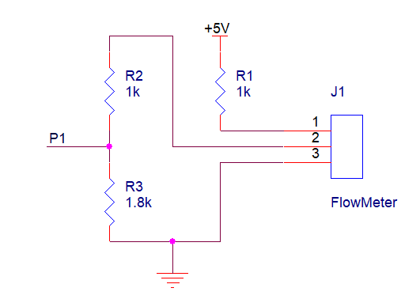

#流量计设计
##修改历史
|版本|日期|说明|作者|
|----|----|----|----|
|V1.0|2022年4月10日|创建流量计设计|马博阳|
|V1.1|2022年4月11日|简化设计方案，修改供电电压|马博阳|
##设计需求
1. 供电电压：3.3V或5V直流供电；
2. 精确度：误差小于±2%；
3. 可以在浴室环境下正常工作。

##流量计方案选择
采用现有的流量计，该流量计使用霍尔元件进行测量，工作时水流带动磁性转子转动，霍尔元件输出相应的脉冲。流量计可用5V供电，输出为5V的脉冲信号，可以通过电阻分压转换为CMOS电平，输入单片机对脉冲计数就可以换算出水流量。该流量计最大可承受1.75Mpa的水压和80℃水温，可计量的流量范围为1-30L/min，误差为±2%[^1]。

中华人民共和国国家标准《建筑给水排水设计规范》GB50015-2003规定，淋浴器额定流量是9L/min，压力不低于0.05-0.5Mpa。同时，浴室热水的最高温度低于80℃，该流量计满足使用需求。
按流量计公式$V=N/450$，以最高流量计算，大致需要每秒计数70个脉冲，考虑到极限情况，每秒计数100个脉冲，按使用时间2小时计算，最大计数720000，需要至少20位计数器，如果另设置变量，可减少到16位，单片机定时器可以实现。

##流量计设计
流量计只需要设计电路提供合适的电压和电流，对输出电平进行转换即可。工作电流要求小于15mA，输出电流要求小于10mA[^2]。

[^1]: https://m.tb.cn/h.fJUOlgH?tk=j29E2SyJUGc
[^2]: https://m.tb.cn/h.fJUOlgH?tk=j29E2SyJUGc