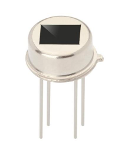
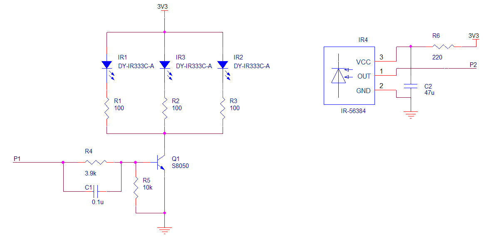
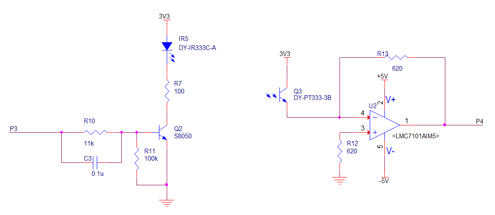
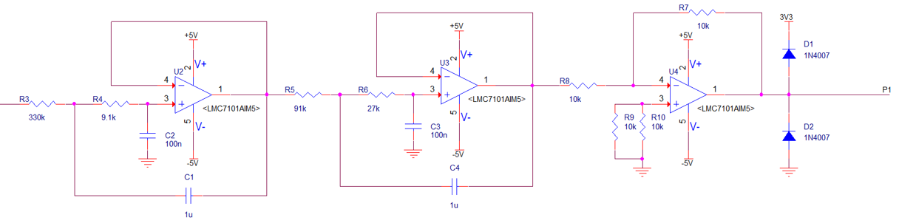

#红外传感器设计
##修改历史
|版本|日期|说明|作者|
|----|----|----|----|
|V1.0|2022年4月10日|创建红外传感器设计|马博阳|
|V1.1|2022年4月10日|修改电源电压，调整检测方案将比较器更换为ADC采样后进行数字比较|马博阳|
|V1.2|2022年4月12日|添加滤波和反相电路|马博阳|
##设计需求
1. 供电电压：3.3V或5V直流供电；
2. 检测正确率：大于99%；
3. 可以在浴室环境下正常工作。

##接近传感器方案选择
###超声波传感器
使用超声波测距，也可也用作物体接近传感器。超声波模块可以提供2 - 450cm的感测功能，测距精度在3mm。为保证测量精度，要求被测物体的面积不小于0.5平方米，且表面平整。该模块在收到有效的触发后进行一次测量，发射超声波，在接收到反射的超声波后，输出与这一过程时间相等的高电平。可以通过高电平计算出被测物体距离。模块价格为10元[^1]。
优点：在浴室环境中，温度与体温接近的水汽不会影响测量结果，光照也不会影响测量结果；可以检测到静止在传感器前的人或物品；与单片机交互简单，不需要做复杂的信号处理。
缺点：由于采用超声波测距，发射和接收探头前不可以有物体阻挡，透明外壳也会阻挡，导致无法正常工作，在浴室环境无法做到绝对防水；体积较大，价格较高。

###红外热释电传感器
热释电传感器通过敏感元件感应外界人体移动产生的红外信号，以差分输入的方式传送到高精度的数字智能处理芯片进行处理，信号处理完成，传感器直接输出数字信号，方便使用。配合菲涅尔透镜，可以调整检测距离和检测范围。该模块价格为5元[^2]。
优点：体积小，价格低，可以做到有效防水。
缺点：该模块通过感应人体发射的红外线实现检测，无法检测物体的存在；该模块通过对比信号的变化检测是否接近，静止状态无法检测；由于采用被动接收环境中红外线的方式，环境温度接近体温以及强光照射会失灵。

###雷达
雷达利用多普勒效应进行检测，需要发生相对移动，对于静止状态人体，需要通过捕捉细微动作进行检测。
优点：集成度高，精确度高，响应快；
缺点：只能检测运动状态，无法检测静止的物体，静止的人体需要及其灵敏检测细微动作，价格十分昂贵。

###主动式红外传感器
主动式红外传感器由红外发射二极管和红外接收二极管组成，红外发射二极管发射波长为940nm的红外线，红外接收二极管在波长940nm处最敏感。主要有两种工作方式：一种是发射红外线，经物体表面反射后被接收二极管检测到，电压发生变化；另一种是发射二极管和接收二极管对射，当有物体阻挡时，无法检测到红外线，电压发生变化。该模块价格为5元以内。
优点：发射管发射940nm红外线，人体及浴室内环境红外辐射的波长约为9000nm - 10000nm，接收管接收400nm - 11000nm，940nm处最敏感，环境影响较小；通过调节发射功率，可以增大检测距离；静止和运动状态都可以检测；可以检测人体和物体；体积小，价格低。
缺点：需要设计驱动电路和信号处理电路，对接收到的信号变化需要处理和判断；检测距离较大时，需要比较高的功率。
###对比和选择
考虑到超声波传感器与热释电传感器在浴室环境很难保证正常工作，选择采用主动式红外传感器。对于红外传感器的缺点，可以在设计电路时采取一定的手段解决。

##红外传感器设计
检测人体采用反射式方案，检测物品篮采用对射式方案，两种方案的电路基本相同，只是布置方式以及输出信号不同。
检测人体需要有至少50cm的检测距离，所以需要较大的发射功率和较为集中的发射角度，保证经过人体反射后的红外线还可以被接收管检测到。检测物品采用对射式，只需要20cm的检测距离，满足检测人体需求的电路可以覆盖检测物品的需求。
###检测人体
为避免环境中红外辐射的干扰，同时降低功耗。采用类似红外遥控的模式，使用频率为38kHz的方波作为载波信号，每次检测时发送一段010101……的调制信号。
根据以上信息，选择`DY-IR333C-A`作为红外发射管，辐射功率可以达到26mW，视角20°，峰值波长940nm，光谱半值宽40nm，正向电压降1.2V，推荐的正向电流20mA，适合这里的需求。
对于红外接收管，有两种选择：一种是单纯的光敏二极管，自己设计信号处理电路；另一种是适用于红外遥控的红外接收管，可以将接收到的信号解调为相应的高低电平。考虑到稳定性和实现的简便性，直接选择适用于红外遥控的红外接收管`IRM-56384`。该接收管输出信号为CMOS电平，便于和单片机交互。
红外传感器电路设计如下图。发射二极管使用单片机的定时器输出管脚控制，电流较大需要通过三极管驱动。为了增大检测距离，使用3个红外发射管，供电电压为3.3V，红外发射管正向电压降1.2V，推荐的正向电流20mA，计算出限流电阻$R_1$、$R_2$和$R_3$为$100\Omega$。三极管集电极电流为60mA，基极电流为0.6mA，计算出限流电阻$R_4$为$3.9k\Omega$。$C_1$可以提高开关速度，$R_5$可以保证在控制信号处于导通的临界值时，不发生误操作。
红外接收管输出信号为CMOS电平，可以直接输入单片机。电源使用电容进行低通滤波和去耦。

###检测物品
由于检测物品采用对射方式，且只需要20cm的检测距离，采用在检测期间红外发射管一直发射红外线，红外接收管在接收到红外线后产生较大的光电流，被物品挡住无法接收到时，电流很小。将该电流转换为电压，输入ADC进行采样量化，与设定的门限判断，低于门限有物品，高于门限无物品。发射管依然选用`DY-IR333C-A`，接收管选用`DY-PT333-3B`。
发射管驱动电路与检测人体电路相同，根据集电极电流不同，重新设置了相应的电阻。接收管电路先将电流信号转换为合适的电压信号，根据数据手册光电流最小为2.67mA，最大为5.07mA，设置电阻$R_f$为$620\Omega$，则$V=-I \times R_f$，输出电压为负，需要后级处理以便于ADC采样和量化。运算放大器选择了5V电压下可用的轨到轨运放。

###滤波和反相处理
对于检测物体的红外接收电路自身的信号频率并不高，但会受到电路中50Hz工频干扰，以及人体检测红外传感器发出的38kHz信号干扰。同时，电流电压转换后为负电压，不便于ADC转换，需要反相处理。我们选择使用通带内平坦的巴特沃斯滤波器，截止频率10Hz，阻带50Hz处衰减50dB，阶数为4阶，使用2级VCVS电路实现，元件参数通过将滤波器传递函数与电路传递函数联立解方程组得到。其后为放大倍数为1的反相放大电路，将电平转换为ADC采样范围内正电压。二极管将电压钳制在-0.7 - 4V，符合单片机GPIO输入要求，避免电压过大损坏。

[^1]: https://m.tb.cn/h.fKW8Bj4?tk=mbTG2SExOpc
[^2]: 郑州炜盛电子科技有限公司,数字热释电传感器使用说明书
