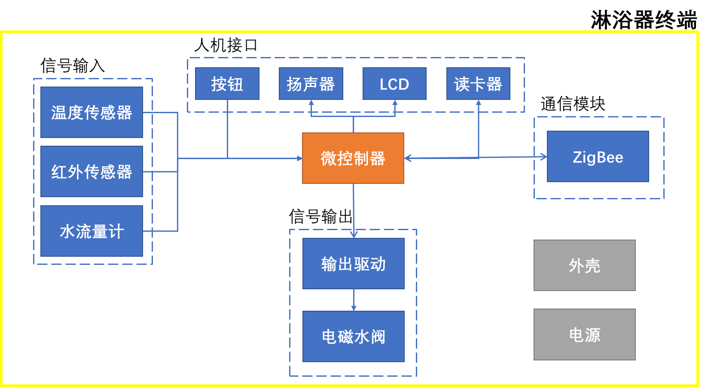
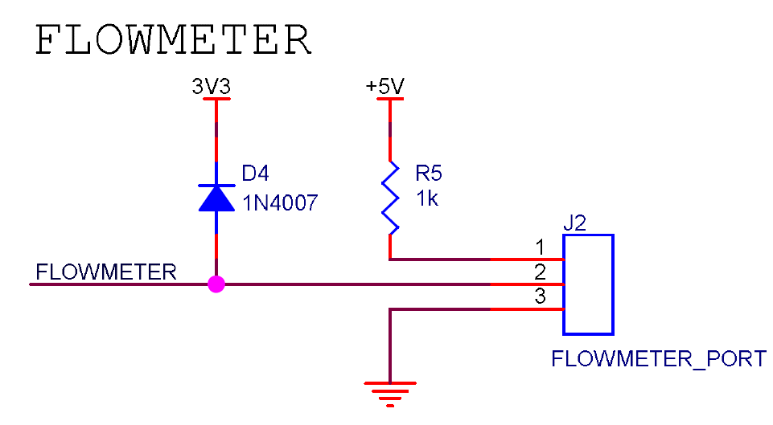
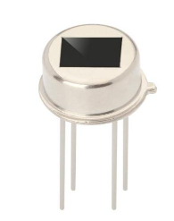
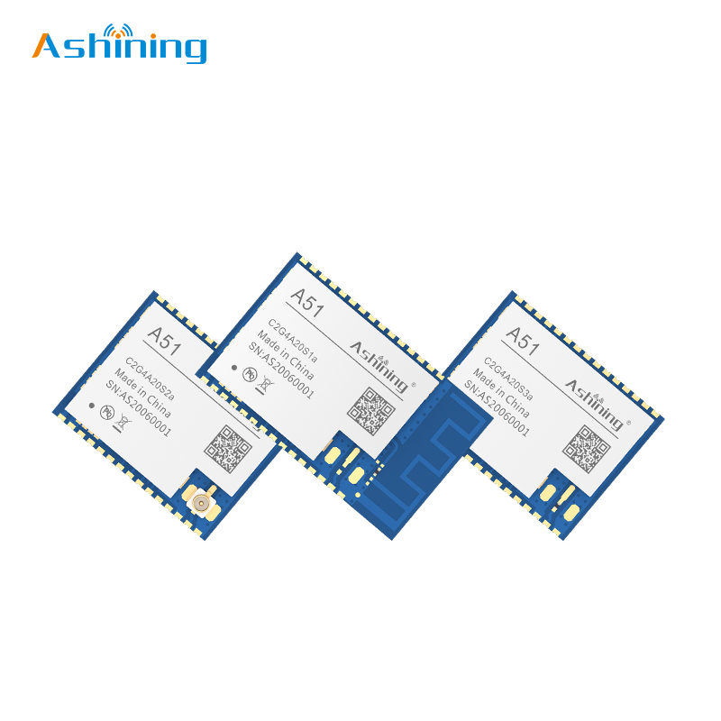

# 修改历史  

|版本|日期|说明|作者|  
|:-:|:-:|:-|:-:|  
|V1.0|2022年4月17日|创建系统设计方案|马博阳|  
|V1.1|2022年4月18日|修改处理器选型，修正音频相关错误|马博阳|  
|V1.2|2022年4月20日|部分设计内容和配图修正|马博阳|  
|V1.3|2022年5月22日|修改通信协议日期时间部分|马博阳|  
# 1. 系统规范  

## 1.1 应用场景  

### 项目应用场景  
本项目的应用场景主要为校园宿舍、公寓等场所内的公共浴室。 
  

### 项目解决痛点  
许多学校仍然只提供公共浴室，由于无法做到提前知晓浴室人数以及提前预约使用浴室，浴室的拥堵现象每天都在发生。  
很多人在洗完澡后遗落随身物品，往往很难立刻意识到物品遗落，返回寻找时经常无法找到，造成不必要的损失。  
由于无法将电子设备带入浴室环境中，忘带毛巾或在洗澡途中澡卡没钱很难求助。  

## 1.2 系统功能  

### 淋浴器终端  
基本功能：用户刷卡出水，计时/计量收费；  
显示屏提示：当前时间、卡内余额、水流温度、学号/用户号、本次消费信息和淋浴器状态信息（是否被预约、是否故障）；  
语音提示：物品遗落、接近预约时间结束、接近供水时间结束等场景提示音；  
用户可通过手机预约洗澡时段，查看浴室当前使用情况和人流量分析，查看预估等待时间，淋浴器终端可检测用户是否按时到达并使用；  
遗落物品检测及报警提示；  
主动求助、报修功能。  

### 淋浴间主机  
数据汇集和转发；  
检测浴室内温度、湿度及亮度，智能控制灯光与换气扇。  

### 云服务平台  
显示浴室当前使用情况，帮助用户合理安排洗澡时间；  
统计用户历史数据，进行分析，为用户提供洗澡时间、水温等建议；  
统计浴室历史使用情况，提供使用高峰和空闲时段分析，用户可据此安排洗澡时间，管理者可据此合理安排整体供水时间。  
统计水温、用水量，为管理者提供设置总供水量、供水温度的建议。  

## 1.3 系统指标  
本项目的系统指标主要在三个方面：功能指标、测试指标和安全指标。其中，功能指标主要测试目标功能是否能够实现；精确度指标主要测试各传感器采集数据的精度是否符合要求，因为本项目的功能实现均依赖于传感器采集的数据；安全指标主要测试在浴室高温高湿环境下的电气安全。  

### 功能指标  
测试方法：模拟公共浴室的使用环境进行功能测试，如果条件允许可以搭建模拟环境或实地测试，由测试人员评价是否完成。  
- 能否实现用户预约和后台智能管理功能；  
- 能否做到遗落物品报警提示和推送通知，使用者主动求助和报修；  
- 能否做到水温、时长、用水量的数据采集、传输和后台智能分析；  
- 能否做到对灯光和换气扇的智能控制。  

### 精确度指标  
测试方法：针对所要测试的传感器设置变化的环境，将采集结果与专用测量设备的结果比较，计算误差。  
- 温度传感器误差控制在±0.5℃；  
- 湿度传感器误差控制在±5%rH；  
- 流量计误差控制在±2%；  
- 红外传感器检测成功率在99%以上。  

### 安全指标  
测试方法：在温度为60℃、湿度为80% - 90%rH的模拟环境中，测试设备能否正常工作，有无漏电现象。  
- 可以长时间连续正常工作；  
- 无漏电现象；  
- 正常工作湿度范围在10% - 90%rH；  
- 正常工作温度范围在0 - 60℃；  
- 强电和弱电隔离；  
- 红外发射功率满足人体安全标准。  

# 2. 智能设备  

## 2.1 总体方案  

### 总体架构图  
公共浴室的结构通常为：每层楼有一个或多个淋浴间，淋浴间由外部的更衣室和内部的多个隔间组成，每个隔间配备有一个淋浴器。本项目的淋浴器终端安装在每个隔间内，替代原有淋浴器，并通过无线传输与淋浴间主机通信；淋浴间主机安装在每个淋浴间，与淋浴器终端通信，并接入互联网与云服务平台通信;云服务平台借助手机、网站等方式为用户提供服务。整体架构图如下图所示。  
  

### 淋浴器终端硬件框图  
淋浴器终端主要分为七部分：微控制器为核心，控制各外设实现目标功能；信号输入部分由温度传感器、红外传感器和水流量计组成，采集到信号并进行调理后送往微控制器；信号输出部分由驱动电路和继电器组成，微控制器通过此部分电路控制电磁水阀的开闭；人机接口部分由按钮、扬声器、LCD显示屏和读卡器组成，实现主动求助、保修、声音提示、信息展示和刷卡功能；通信模块使用ZigBee完成无线传输；电源模块为整个终端供电；外壳实现保护和防水。  
  

### 淋浴间主机硬件框图  
淋浴间主机主要分为七部分：微控制器为核心，控制各外设实现目标功能；信号输入部分由温度传感器、湿度传感器和光敏元件组成，采集到信号并进行调理后送往微控制器；信号输出部分由驱动电路和继电器组成，微控制器通过此部分电路控制灯光和换气扇的开闭；人机接口部分由按钮、扬声器和LCD显示屏组成，实现主动求助、保修、声音提示和信息展示功能；通信模块使用ZigBee与淋浴器终端通信，使用WiFi接入互联网与云服务平台通信；电源模块为整个主机供电；外壳实现保护和防水。  
  

## 2.2 硬件设计  
具体设计文档在淋浴器终端和淋浴间主机对应文件下的文档文件夹中。  

### 信号输入  

#### 1. 流量计  
设计需求：供电电压为3.3V或5V直流供电；误差小于±2%；可以在浴室环境下正常工作。  

采用现有的流量计，该流量计使用霍尔元件进行测量，工作时水流带动磁性转子转动，霍尔元件输出相应的脉冲。流量计可用5V供电，输出为5V的脉冲信号，可以通过电阻分压转换为CMOS电平，输入单片机对脉冲计数就可以换算出水流量。该流量计最大可承受1.75Mpa的水压和80℃水温，可计量的流量范围为1-30L/min，误差为±2%。  
中华人民共和国国家标准《建筑给水排水设计规范》GB50015-2003规定，淋浴器额定流量是9L/min，压力不低于0.05 - 0.5Mpa。同时，浴室热水的最高温度低于80℃，该流量计满足使用需求。  
按流量计公式$V=N/450$，以最高流量计算，大致需要每秒计数70个脉冲，考虑到极限情况，每秒计数100个脉冲，按使用时间2小时计算，最大计数720000，需要至少20位计数器，如果另设置变量，可减少到16位，单片机定时器可以实现。  
  

流量计只需要设计电路提供合适的电压和电流，对输出电平进行转换即可。工作电流要求小于15mA，输出电流要求小于10mA。电平转换可以采用二极管钳位，将电平最大值限制在4V，单片机的GPIO口可以接受4V的电压。    
  

#### 2. 水温传感器  
设计需求：供电电压为3.3V或5V直流供电；测温范围为0 - 60℃；误差不大于±0.5℃；可以在浴室环境下正常工作。  

`DS18B20`数字温度计提供9位至12位摄氏温度测量，并具有报警功能，具有非易失性用户可编程的上下触发点。`DS18B20`通过1-Wire总线进行通信。根据定义，该总线只需要一根数据线（和地线）即可与中央微处理器通信。它的工作温度范围为 -55 - 125℃，在-10 - 70℃的范围内精确到±0.4℃。价格6元。优点：使用简单，精确度高。缺点：防水探头15元以上，价格较高；温度响应速度慢。  
  

本项目对于温度响应速度要求不高，考虑到电路实现的简便，防水探头的价格也在可以接受的范围内。  
使用`DS18B20`，电路设计只需要提供电源，并将数据线与单片机连接即可。  
  

#### 3. 红外传感器  
设计需求：供电电压为3.3V或5V直流供电；检测正确率大于99%；红外发射功率满足人体安全标准；可以在浴室环境下正常工作。  

接近传感器方案选择：考虑到超声波传感器与热释电传感器在浴室环境很难保证正常工作，选择采用主动式红外传感器。对于红外传感器的缺点，可以在设计电路时采取一定的手段解决。  
**超声波传感器**  
超声波传感器一般用作测距，也可用作物体接近传感器。超声波模块可以提供2 - 450cm的感测功能，测距精度在3mm。为保证测量精度，要求被测物体的面积不小于0.5平方米，且表面平整。该模块在收到有效的触发后进行一次测量，发射超声波，在接收到反射的超声波后，输出与这一过程时间相等的高电平。可以通过高电平计算出被测物体距离。模块价格为10元。  
优点：成本相对较低，对环境光照不敏感，雨天和雾天可正常工作。对应在浴室环境中，温度与体温接近的水汽不会影响测量结果，浴室光照也不会影响测量结果。可以检测到静止在传感器前的人或物品；与单片机交互简单，不需要做复杂的信号处理。  
缺点：由于采用超声波测距，发射和接收探头前不可以有物体阻挡，透明外壳也会阻挡，导致无法正常工作，在浴室环境无法做到绝对防水；体积较大；对湿度、风力和气压敏感。  
  
**被动红外传感器**  
被动红外传感器中，热释电传感器具有代表性。该传感器通过敏感元件感应外界人体移动产生的红外信号，以差分输入的方式传送到高精度的数字智能处理芯片进行处理，信号处理完成，传感器直接输出数字信号，方便使用。配合菲涅尔透镜，可以调整检测距离和检测范围。该模块价格为5元。  
优点：体积小，价格低，功耗低，可以做到有效防水。  
缺点：该模块通过感应人体发射的红外线实现检测，无法检测物体的存在；该模块通过对比信号的变化检测是否接近，静止状态无法检测；由于采用被动接收环境中红外线的方式，环境温度接近体温以及强光照射会失灵。  
  
**雷达**  
雷达利用多普勒效应进行检测，需要发生相对移动，对于静止状态人体，需要通过捕捉细微动作进行检测。  
优点：集成度高，精确度高，响应快。  
缺点：只能检测运动状态，无法检测静止的物体，静止的人体需要及其灵敏检测细微动作，价格十分昂贵。  
  
**主动式红外传感器**  
主动式红外传感器由红外发射二极管和红外接收二极管组成，红外发射二极管发射波长为940nm的红外线，红外接收二极管在波长940nm处最敏感。主要有两种工作方式：一种是发射红外线，经物体表面反射后被接收二极管检测到，电压发生变化；另一种是发射二极管和接收二极管对射，当有物体阻挡时，无法检测到红外线，电压发生变化。该模块价格为5元以内。  
优点：发射管发射940nm红外线，人体及浴室内环境红外辐射的波长约为9000nm - 10000nm，接收管接收400nm - 11000nm，940nm处最敏感，环境影响较小；通过调节发射功率，可以增大检测距离；静止和运动状态都可以检测；可以检测人体和物体；体积小，价格低。  
缺点：需要设计驱动电路和信号处理电路，对接收到的信号变化需要处理和判断；检测距离较大时，需要比较高的功率。  
**对比和选择**  
考虑到超声波传感器与热释电传感器在浴室环境很难保证正常工作，选择采用主动式红外传感器。对于红外传感器的缺点，可以在设计电路时采取一定的手段解决。  

**方案可行性分析**  
**环境光照对准确性影响很小**：我们选择的红外发射管发射940nm红外线，接收管接收400nm - 11000nm，940nm处最敏感。  
环境中的光线主要由透过窗户进入的阳光和室内照明灯具组成，人体和其他物体的热辐射产生的红外线功率相对较低，并且波长远大于我们使用的红外线波长，这里可以忽略。  
阳光的频谱能量在940nm附近有明显的波谷，所以对于我们的应用影响较小，具体可参考`TI`公司`《飞行时间远距离接近和距离传感器系统设计介绍》`图10。  
  
室内灯光的设计波长通常在可见光范围内，在940nm附近能量相对较低，但部分灯具在这一波段仍有相当的能量。  
对于室内灯光的影响，我们可以考虑对信号进行调制，以提高抗噪声能力。  
**安全性分析**：由于我们需要产生相对较高功率的红外线，对人体会有一定的安全隐患。  
根据国际电工委员会相关的标准`IEC-62471`，非激光半导体光源的辐射量很低，长时间接触也不会引起皮肤生物效应，我们主要考虑人眼安全。  
根据本项目中红外线的发射方式，并且外壳保证即使人眼贴近发射管，仍相距5mm以上。由公式计算可以得到最大功率仍在安全范围内。  

**方案设计**  
检测人体采用反射式方案，检测物品篮采用对射式方案，两种方案的发射电路基本相同，只是布置方式以及接收电路不同。检测人体需要有至少50cm的检测距离，所以需要较大的发射功率和较为集中的发射角度，保证经过人体反射后的红外线还可以被接收管检测到。检测物品采用对射式，只需要20cm的检测距离，满足检测人体需求的电路可以覆盖检测物品的需求。  
**检测人体**：为避免环境中红外辐射的干扰，同时降低功耗。采用类似红外遥控的模式，使用频率为38kHz的方波作为载波信号，每次检测时发送一段010101……的调制信号。根据以上信息，选择`DY-IR333C-A`作为红外发射管，辐射功率可以达到26mW，视角20°，峰值波长940nm，光谱半值宽40nm，正向电压降1.2V，推荐的正向电流20mA，适合这里的需求。对于红外接收管，有两种选择：一种是单纯的光敏二极管，自己设计信号处理电路；另一种是适用于红外遥控的红外接收管，可以将接收到的信号解调为相应的高低电平。考虑到稳定性和实现的简便性，直接选择适用于红外遥控的红外接收管`IRM-56384`。该接收管输出信号为CMOS电平，便于和单片机交互。红外传感器电路设计如下图。发射二极管使用单片机的定时器输出管脚控制，电流较大需要通过三极管驱动。为了增大检测距离，使用3个红外发射管，供电电压为3.3V，红外发射管正向电压降1.2V，推荐的正向电流20mA，计算出限流电阻$R_1$、$R_2$和$R_3$为100Ω。三极管集电极电流为60mA，基极电流为0.6mA，计算出限流电阻$R_4$为3.9kΩ。$C_1$可以提高开关速度，$R_5$可以保证在控制信号处于导通的临界值时，不发生误操作。使用3个红外发射管并联，可以增大发射功率。红外接收管输出信号为CMOS电平，可以直接输入单片机。电源使用电容进行低通滤波和去耦。  
  
**检测物品**：由于检测物品采用对射方式，且只需要20cm的检测距离，采用在检测期间红外发射管一直发射红外线，红外接收管在接收到红外线后产生较大的光电流，被物品挡住无法接收到时，电流很小。将该电流转换为电压，输入ADC进行采样量化，与设定的门限判断，低于门限有物品，高于门限无物品。发射管依然选用`DY-IR333C-A`，接收管选用`DY-PT333-3B`。发射管驱动电路与检测人体电路相同，根据集电极电流不同，重新设置了相应的电阻。接收管电路先将电流信号转换为合适的电压信号，根据数据手册光电流最小为2.67mA，最大为5.07mA，设置电阻$R_f$为620Ω，则$V=-I \times R_f$，输出电压为负，需要后级处理以便于ADC采样和量化。为便于查看，此处并未使用集成运算放大器芯片，而是用符号进行标注，运算放大器选择了5V电压下可用的轨到轨运放`TLV2374`。  
  
**滤波和反相**：对于检测物体的红外接收电路自身的信号频率并不高，但会受到电路中50Hz工频干扰，以及人体检测红外传感器发出的38kHz信号干扰。同时，电流电压转换后为负电压，不便于ADC转换，需要反相处理。我们选择使用通带内平坦的巴特沃斯滤波器，截止频率10Hz，阻带50Hz处衰减50dB，阶数为4阶，使用2级VCVS电路实现，元件参数通过将滤波器传递函数与电路传递函数联立解方程组得到。其后为放大倍数为1的反相放大电路，将电平转换为ADC采样范围内正电压。二极管将电压钳制在-0.7 - 4V，符合单片机GPIO输入要求，避免电压过大损坏。为便于查看，此处并未使用集成运算放大器芯片，而是用符号进行标注，具体使用的运算放大器为5V电压下可用的轨到轨运放`TLV2374`。  
  

#### 4. 温湿度传感器  
设计需求：供电电压为3.3V或5V直流供电；湿度误差不大于±5%rH；湿度测量范围为10% - 90%rH；温度误差不大于±0.5℃；温度测量范围为0 - 60℃；可以在浴室环境下正常工作。  

数字温湿度传感模块`DHT21`是采用高稳定性电容式感湿元件作为传感元件，经过微处理器采集处理转化成数字信号输出。每一个传感器都经过标定校准和测试。具有长期稳定、可靠性高、精度高、低功耗等特点。使用3.3V供电，单总线输出，可直接连接单片机。相对湿度在10% - 90%rH的误差不大于±4%rH，温度在10 - 50℃范围内不大于±0.4℃，满足需求。  
    

使用`DHT21`，电路设计只需要提供电源，并将数据线与单片机连接即可。  
  

#### 5. 光照传感器  
设计需求：供电电压为3.3V或5V直流供电；可以在浴室环境下正常工作。  

光照传感器方案选择：现有光照传感器模块体积过大不便于集成和防水；光照传感器芯片为贴片式，需要在防水的前提下对外壳做特殊设计，保证环境光线可以照射到芯片表面。光敏电阻对于光强的变化不敏感，判断精度差；光电二极管电流较小不方便处理，采用光电三极管。  
**光敏电阻**：在没有光照时，电阻很大；在一定波长范围的光照下，电阻值明显变小。  
**光电二极管**：光电二极管结构和普通二极管类似，只是结面积比普通二极管大，便于接收光线。光电二极管在反向电压下工作的。它的暗电流很小，在光线照射下产生载流子，它们参加导电会增大反向饱和电流。载流子的数量与光强度有关，因此，反向饱和电流会随着光强的变化而变化，从而可以把光信号的变化转为电流及电压的变化。  
**光电三极管**：光电三极管结构和普通三极管类似，但基极未引出，且面积较大，可以接收光线。光照时可产生基极电流，集电极产生放大后的基极电流。光电三极管与光电二极管类似，只是经过放大电流更大，更为敏感。  
  

先将三极管的电流信号转换为合适的电压信号，根据数据手册光电流在10流明时最小为5μA，在100流明时最大为100μA，设置电阻$R_f$为10kΩ，则$V=-I \times R_f$，此时为负电压，需要后级处理便于ADC采样和量化。运算放大器选择了5V电压下可用的轨到轨运放`TLV2374`。滤波和反相处理电路同红外接收电路，这里不再详细分析。为便于读图，避免集成运算放大器芯片造成的读图困难，运算放大器在图中进行了特殊的标注。  
  

#### 6. 电路仿真  
对滤波电路和钳位电路进行仿真，结果符合设计需求。  
  
  

### 信号输出  
设计需求：继电器线圈电压5V；使用单片机GPIO控制继电器；可以在浴室环境下正常工作。  
由于需要控制照明、通风和电磁阀，继电器需要能够切换220V交流电或12V直流电，能够承受1A电流，线圈供电电压5V，选择`973-5VDC-SL-A`。  
  
继电器自身所需的电流和电压大于单片机GPIO所能提供的电流和电压，使用三极管`S8050`驱动继电器。为了避免三极管关闭时，继电器线圈内的电流造成损坏，将二极管`1N4007`与继电器并联。照明、通风和电磁水阀的驱动电路类似，以驱动电磁水阀为例。  
  

### 人机接口  
设计需求：供电电压：3.3V或5V直流供电；实现显示、播放音频、按键和识别NFC卡片等功能。  

人机接口直接选择相应模块或芯片。  
- 显示屏：0.91寸LCD显示屏模块，3.3V供电，IIC接口；  
  
- 读卡器：RC522 MINI模块， 3.3V供电， SPI接口；  
  
- 扬声器：内置Flash的语音芯片`WT588F08A-8S`，通过串口控制和写入数据，可直接驱动扬声器；  
  
  
- 按钮：微动开关+按键帽+防水套。  
  
  

大部分模块只需要设计接口，扬声器和按钮需要设计驱动电路。  
  
  
扬声器模块通过音频芯片驱动扬声器，音频芯片需要3.3V供电，直接与单片机交互，输出可以直接驱动阻抗8Ω功率0.5W的扬声器，并增设指示灯。  
  
按钮采用上拉方式，以其中一个为例。  
  

### 通信模块  
为保证数据安全，避免断网时无法使用，以及终端数量的扩展性，通信分为两层：终端使用ZigBee将数据传输至主机，主机使用WiFi与云服务平台通信。  

#### 1. 终端与主机通信  
淋浴器终端使用ZigBee终端设备，淋浴间主机使用ZigBee协调器。由淋浴间主机的ZigBee模块启动整个网络，建立起星型拓扑结构。  

传输流程：发送方发送数据；接收方接收成功发送成功响应，接收方接收错误发送失败响应；发送方接收到成功响应发送成功响应，结束传输，发送方接收到错误响应重发数据，第二次传输仍失败停止传输并报故障。  

- **响应帧格式**  
    - **成功响应**：  
        - `A`  
        - 1字节设备编号：终端发送时为终端的编号；主机发送时为目标终端号（全0为广播）  
        - 1字节结束标志符：$  
    - **失败响应**：  
        - `N`  
        - 1字节设备编号：终端发送时为终端的编号；主机发送时为目标终端号（全0为广播）  
        - 1字节结束标志符：$  
- **数据帧格式**  
    - 1字节消息类型：S，终端发送的消息；H，主机发送的消息；E，紧急消息  
    - 1字节设备编号：终端发送时为终端的编号；主机发送时为目标终端号（全0为广播）  
    - 4字节用户编号：终端发送时为NFC卡号；主机发送时为用户号/学号（全0表示无信息/此卡已挂失）  
    - 4字节当前日期  
    - 4字节当前时间  
    - 4字节当前水温，紧急消息不包含  
    - 4字节当前流量，紧急消息不包含  
    - 4字节当前余额，紧急消息不包含  
    - 2字节状态信息：具体表示见下节  
    - 2字节是否设置：某一位为0表示不设置对应状态位，某一位为1表示设置对应状态位  
    - 1字节结束标志符：$  

|1字节|4字节|4字节|4字节|4字节|4字节|4字节|2字节|2字节|1字节|  
|:---:|:---:|:---:|:---:|:---:|:---:|:---:|:---:|:---:|:---:|  
|消息类型|设备编号|用户编号|当前时间|水温|流量|余额|状态信息|是否设置|结束标志$|  

**状态信息**  

|15-9|8|7|6|5|4|3|2|1|0|  
|:---:|:---:|:---:|:---:|:---:|:---:|:---:|:---:|:---:|:---:|  
|无效位|是否停供水|是否故障|是否预约|是否正在使用|是否遗落物品|是否第一次刷卡|是否取卡|是否求助|是否报修|  

选用成都泽耀科技有限公司的ZigBee模块`A40-C2G4A04S1a`，该模块使用TI公司的`CC2530`芯片，可以实现自组网，每个模块都可配置为协调器、路由器和终端。该模块使用镀金半孔引脚，可直接焊接在PCB板上。  
  

按照模块数据手册推荐电路进行设计。  
  

#### 2. 主机与云平台通信  
淋浴间主机连接WiFi接入互联网。  
传输流程：发送方发送数据；接收方接收成功发送成功响应，接收方接收错误发送失败响应；发送方接收到成功响应发送成功响应，结束传输，发送方接收到错误响应重发数据，第二次传输仍失败停止传输并报故障。  

- **响应帧格式**  
    - **成功响应**：  
        - `A`  
        - 1字节设备编号：终端发送时为终端的编号；主机发送时为目标终端号（全0为广播）  
        - 1字节结束标志符：@  
    - **失败响应**：  
        - `N`  
        - 1字节设备编号：终端发送时为终端的编号；主机- 发送时为目标终端号（全0为广播）  
        - 1字节结束标志符：@  
- **数据帧格式**  
    - 1字节消息类型：H，主机发送的消息；C，云平台发送的消息；E，紧急消息  
    - 1字节设备编号：主机发送时为主机的编号；云平台发送时为目标主机号（全0为广播）  
    - 4字节当前时间  
    - 4字节浴室温度，紧急消息不包含  
    - 4字节浴室湿度，紧急消息不包含  
    - 4字节浴室光照，紧急消息不包含  
    - 1字节浴室状态信息：具体表示见下节  
    - 1字节是否设置：某一位为0表示不设置对应状态位，某一位为1表示设置对应状态位  
    - 1字节需要发送的终端数据个数N，但最多支持16个设备  
    - N*27字节终端数据：ZigBee接收数据的合并  
    - 1字节结束标志符：@  

|1字节|1字节|4字节|4字节|4字节|4字节|1字节|1字节|1字节|N*27字节|1字节|  
|:---:|:---:|:---:|:---:|:---:|:---:|:---:|:---:|:---:|:---:|:---:|  
|消息类型|设备编号|当前时间|浴室温度|浴室湿度|浴室光照|状态信息|是否设置|数据个数N|终端数据|结束标志@|  

**状态信息**  

|7-5|4|3|2|1|0|  
|:---:|:---:|:---:|:---:|:---:|:---:|  
|无效位|是否通风|是否照明|是否停供水|是否报修|是否求助|  

选用成都泽耀科技有限公司的WiFi模块`A51-C2G4A20S1a`，该模块为2.4G频段，基于乐鑫`ESP8266EX`为核心处理器。支持AT、TCP/UDP、MQTT等模式，可配置为STATION或AP。该模块使用镀金半孔引脚，可直接焊接在PCB板上。  
  

按照模块数据手册推荐电路进行设计。  
  

### 电源模块  
设计需求：输入为市电：220VAC；输出为3路电源：±5VDC和3.3VDC；强电和弱电隔离；可以在浴室环境下正常工作，保证设备安全。  

为保证浴室环境内的用电安全，电路设计分为两部分：第一部分为AC-DC模块，将220V交流电转换为±5V直流电，低于潮湿环境人体安全电压12V，这一部分设置在模块外，可单独布置在浴室外；第二部分为直流稳压，在淋浴器终端和淋浴间主机内，对±5V直流输入滤波，并将+5V直流转换为3.3V直流并稳压。  
考虑到AC-DC模块有一定的安全问题，直接采用LM旗舰店提供的现有模块`RH-30W+5V/-5V`，该模块电气参数符合需求，并且为隔离变压器，实现了强弱电隔离。  
  

淋浴器终端和淋浴间主机电源部分设计如下， 220μF和0.1μF电容并联，实现对±5V电源的滤波和去耦；`TLV1117`将+5V输出稳压至3.3V。  
  

### 处理器  
设计需求：供电电压为3.3V或5V直流供电；包含至少1个多通道ADC，支持数据采集；至少4个16位定时器，支持PWM波形输出；包含RTC支持实时日期时间；SPI、IIC通信接口、DMA；GPIO数量至少21个，最大能承受4V电压输入。  

STM32F401RE基于高性能ARM®Cortex®-M4 32位RISC内核，工作频率高达84 MHz。其Cortex®-M4内核具有单精度浮点单元（FPU），支持所有ARM单精度数据处理指令和数据类型。它还实现了一整套DSP指令和内存保护单元（MPU），增强了应用安全性。STM32F401RE集成了高速嵌入式存储器（512KB闪存、96KB SRAM），以及连接到两条APB总线、两条AHB总线和一个32位多AHB总线矩阵的大量增强型I/O和外设。所有器件都提供一个12位ADC、一个低功耗RTC、六个通用的16位定时器（包括一个用于电机控制的PWM定时器）、两个通用的32位定时器。具有标准和先进的通信接口。  
  
- 1.7 V至3.6 V应用电源和I/O；  
- 1×12位，2.4 MSPS A/D转换器：多达16个通道；  
- 通用DMA：带有FIFO和突发支持的16流DMA控制器；  
- 11个定时器：6个16位、2个32位定时器，频率高达84 MHz，每个定时器有4个IC/OC/PWM或脉冲计数器和正交（增量）编码器输入，两个看门狗定时器（独立和窗口）和一个SysTick定时器；  
串行线调试（SWD）和JTAG接口；  
- 多达81个具有中断能力的I/O端口，多达78个快速I/O，频率高达42MHz；  
- 所有的I/O端口都是5V耐压的；  
- 多达12个通信接口；  
    - 多达3个IIC接口；  
    - 多达3个USART（2个10.5 Mbit/s，1个5.25 Mbit/s）；  
    - 多达4个SPI（在fCPU=84 MHz时高达42Mbit/s）；  
    - SDIO接口；  
    - 带有片上PHY的USB 2.0全速设备/主机/OTG控制器；  
- RTC：亚秒级精度，硬件日历。  

MCU外围电路主要由电源、外部晶振、复位和调试器接口四部分组成。参照数据手册和原理图设计即可。  
  

## 2.3 软件设计  

### 淋浴器终端流程图  
  

### 淋浴间主机流程图  
  

## 2.4 外壳设计  

### 制作方案  
设计需求：保证在浴室环境的防水和用电安全。  

设计方案：双层防水设计，外部用透明外壳包裹，内部使用塑料外壳；内部塑料外壳使用3D打印的塑料外壳，避免潮湿环境生锈；接口和接线处使用防水胶密封；按键使用防水键帽，将键帽和外壳用防水胶粘接。  

### 示意图（正面）  
  
  

# 3. 智能服务  

## 3.1 接口设计  
平台选择阿里云物联网平台和微信小程序。主机按照先前设计的基于字符串的自定义格式，将数据上传至服务器，服务器对数据解析后存入数据库；服务器根据解析后的主机数据，请求查询数据，并按照同样的格式将数据下发至主机设备，控制信息也按照同样的流程发送。  
  

## 3.2 数据库设计  
数据库包含6个表：用户信息表，管理员信息表，报修求助信息表，预约信息表，隔间状态信息表，浴室状态信息表。  
  

## 3.3 人机界面设计  

### 用户界面  
  

### 管理员界面  
  

## 3.4 服务平台流程图  

### 用户  
  

### 管理员  
  

# 4. 系统调试  

## 4.1 测试场景  
功能测试：可以将设备按照设计，放置在现有浴室的对应位置，或按照相应的距离和环境，在实验室模拟浴室，进行功能测试，功能测试不关注浴室的高温高湿环境，只测试功能是否能够实现。  

指标测试：可以单独测试对应模块的指标，或者将设备放置在模拟环境中进行测试。  

安全性测试：可以将设备与加湿器、加热器同时放置在较为密闭的盒中，并淋水模拟浴室，观察能否正常工作，是否有漏电现象。  

## 4.2 测试方法  
功能测试方法：通过模拟使用环境进行功能测试，同时单独测试高温高湿环境下稳定性。  

指标测试方法：将采集结果与专用测量设备的结果比较，计算误差。  

安全测试方法：在温度为60℃、湿度为80 −90% 的环境中，测试能否正常工作，有无漏电现象。  

# 5. 本阶段分工  
马博阳：总体方案设计、设备硬件设计、设备软件设计、文档撰写、PPT制作。  
綦浩楠：总体方案修改、云服务平台设计、服务软件设计、文档修改。  
沙禹吉：外壳设计软件学习、设备外壳设计。  
