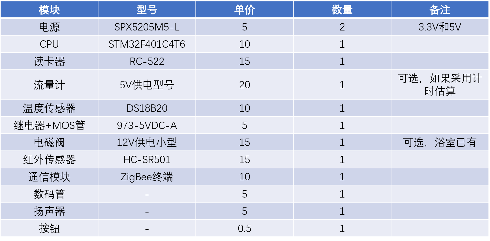

# 1. 项目定义  
## 1.1 项目背景  
### 应用场景及用户痛点  
本项目的应用场景主要为校园宿舍、公寓等场所内的公共浴室。我们关注到许多学校现在仍然只提供公共浴室，但由于使用者在进入浴室前对浴室的使用情况并不知情，经常会出现某个时间段浴室无人使用，而另一个时间段又严重拥挤的情况。  
这样的拥堵现象几乎每天都在发生，同时很多人在洗完澡后遗落随身物品，不能及时发现。在意识到遗落物品返回寻找时，往往找不到遗落的物品，造成不必要的损失。  
### 项目意义  
本项目通过对浴室内环境数据的检测，提供预约洗澡时间、获取当前浴室占用情况等功能，避免使用者长时间排队；同时，可以在使用者遗落随身物品时发出提醒，及时发现并取走自己的物品。  
在此基础上，我们建立服务平台，通过数据采集、分析，提示浴室内人数较少的时段；分析得出浴室使用时间、用水量、水温的统计信息，帮助管理者调整浴室系统，提高资源利用率；自动控制浴室灯光、换气扇，降低能耗，有利于可持续发展。  
## 1.2 竞品分析  
### 现有产品功能分析  
现有产品主要有两类：一类是目前市场上已有公司生产类似产品并投入部分高校使用，另一类是还未落地生产的解决方案。综合分析这两类产品，可以概括出现有产品的主要功能为：手机预约洗澡时间并给出客流量时间分布数据和图像[^1]；采集环境信息控制灯光、换气扇[^2]；通过智能控制实现节水节能[^3]；其他相关产品主要集中于家庭卫浴的智能化，功能不适合学校公共浴室场景，并且价格较高不适合学校内大规模使用[^4]。  
### 现有产品与本项目优缺点对比  
与现有智能浴室管理系统相比，本项目在功能基本覆盖的基础上，实现了更多急需的功能。首先是对于预约功能的改进，通过数据采集和分析，本项目可以实现自适应的时间段而非传统预约系统的固定时间段；其次是可以检测浴室内是否真实有人，避免占用浴室而不洗澡的情况发生，提高浴室利用率；再次是通过对采集的水温、用水量、使用时间数据进行分析，为管理者提供决策辅助；最后是可以检测到遗落物品并报警提示。具体对比分析如下表所示。  
|功能|现有产品|本项目|  
|:----|:-----:|:---:|  
|环境感应和灯光、通风智能控制|Y|Y|  
|浴室占用情况展示和用户预约|Y，时间段固定|Y，时间段自适应|  
|客流量统计和数据展示|Y|Y|  
|浴室是否真实有人检测|N|Y|  
|水温、用水量、使用时间数据采集|N|Y|  
|数据分析和决策辅助|N|Y|  
|遗落物品报警|N|Y|  
|主动求助、报修|Y|Y|  
## 1.3 项目目标  
根据以上分析，针对校园宿舍、公寓等场所内的公共浴室，为解决目前的用户痛点，本项目的目标是实现以下功能：  
- 基本的淋浴器功能和信息展示；  
- 检测浴室内温度、湿度及亮度，智能控制灯光与换气扇；  
- 手机预约、人流量分析、预估等待时间，检测是否按时到达使用；  
- 统计浴室使用情况，为个人提供建议洗澡时间，帮助管理者设置供水时间；  
- 统计水温、用水量，为管理者提供设置供水时间、水量、水温的建议；  
- 遗落物品检测及报警提示；  
- 主动求助、报修功能。  
## 1.4 系统指标  
本项目的系统指标主要在三个方面：功能指标、测试指标和安全指标。其中，功能指标主要测试目标功能是否能够实现；精确度指标主要测试各传感器采集数据的精度是否符合要求，因为本项目的功能实现均依赖于传感器采集的数据；安全指标主要测试在浴室高温高湿环境下的电气安全。  
### 功能指标  
测试方法：模拟公共浴室的使用环境进行功能测试，如果条件允许可以搭建模拟环境或实地测试，由测试人员评价是否完成。  
- 能否实现用户预约和后台智能管理功能  
- 能否做到遗落物品报警提示和推送通知，使用者主动求助和报修  
- 能否做到水温、时长、用水量的数据采集、传输和后台智能分析  
- 能否做到对灯光和换气扇的智能控制  
### 精确度指标  
测试方法：针对所要测试的传感器设置变化的环境，将采集结果与专用测量设备的结果比较，计算误差。  
- 温度传感器误差控制在$ \pm1\% $  
- 湿度传感器误差控制在$ \pm5\% $  
- 流量计误差控制在$ \pm2\% $  
- 红外传感器检测成功率在$ 99\% $以上  
### 安全指标  
测试方法：在温度为$30^\circ C$、湿度为 $ 80 - 90\% $的模拟环境中，测试设备能否正常工作，有无漏电现象。  
- 可以长时间连续正常工作  
- 无漏电现象  
# 2. 项目原理  
## 2.1 系统框架  
### 模块划分  
项目主体分为3部分：淋浴器终端、淋浴间主机、云服务平台，各部分具体介绍如下：  
**淋浴器终端**：实现基本的淋浴器功能，实现对水温、使用时间、用水量的数据采集整合和发送，实现遗落物品报警提示功能，实现使用者主动报修、求助，实现可视化展示部分数据；  
**淋浴间主机**：实现淋浴器终端传输数据的汇聚整合和发送，实现对浴室灯光、换气扇的自动控制；  
**云服务平台**：数据存储和分析处理，智能管理，预约功能。  
### 系统框图  
公共浴室的结构通常为：每层楼有一个或多个淋浴间，淋浴间由外部的更衣室和内部的多个隔间组成，每个隔间配备有一个淋浴器。本项目的淋浴器终端安装在每个隔间内，替代原有淋浴器，并通过无线传输与淋浴间主机通信；淋浴间主机安装在每个淋浴间，与淋浴器终端通信，并接入互联网与云服务平台通信;云服务平台借助手机、网站等方式为用户提供服务。整体架构图如下图所示。  
  
淋浴器终端主要分为七部分：微控制器为核心，控制各外设实现目标功能；信号输入部分由温度传感器、红外传感器和水流量计组成，采集到信号并进行调理后送往微控制器；信号输出部分由驱动电路和继电器组成，微控制器通过此部分电路控制电磁水阀的开闭；人机接口部分由按钮、扬声器、LCD显示屏和读卡器组成，实现主动求助、保修、声音提示、信息展示和刷卡功能；通信模块使用ZigBee完成无线传输；电源模块为整个终端供电；外壳实现保护和防水。  
  
淋浴间主机主要分为七部分：微控制器为核心，控制各外设实现目标功能；信号输入部分由温度传感器、湿度传感器和光敏元件组成，采集到信号并进行调理后送往微控制器；信号输出部分由驱动电路和继电器组成，微控制器通过此部分电路控制灯光和换气扇的开闭；人机接口部分由按钮、扬声器和LCD显示屏组成，实现主动求助、保修、声音提示和信息展示功能；通信模块使用ZigBee与淋浴器终端通信，使用WiFi接入互联网与云服务平台通信；电源模块为整个主机供电；外壳实现保护和防水。  
  
## 2.2 系统原理  
本项目的数据采集使用相应传感器元件完成。其中流量计输出为脉冲信号，可使用MCU计数脉冲并换算为水流量；其余元件产生电压信号，可通过MCU的ADC采样并换算；淋浴间是否实际使用以及物品遗落通过红外传感器检测，以求保证个人隐私。  
数据传输采用ZigBee和WiFi。淋浴器终端与淋浴间主机之间的拓扑结构为星型结构，适合使用ZigBee，且ZigBee成本低、使用的频段无需授权；淋浴间主机通过WiFi接入互联网，在接入互联网的各方案中，WiFi方式成本低、操作简单，可以充分利用现有的校园无线网。  
MCU配合功率驱动电路，提高控制信号的驱动能力；再由此信号控制继电器实现对电磁水阀、灯光、换气扇的控制，以及强弱电的隔离。  
云服务平台借助MySQL数据库、有关数据统计算法，实现数据分析和提示；借助微信小程序平台为用户提供服务。如果数据量大，可以考虑将数据库转移到云端，使用阿里云、腾讯云、百度云等现有云平台。  
## 2.3 开发计划  
本团队在开发计划的制定中，使用甘特图进行分工管理，具体的人员分工和开发计划可见如下甘特图。  
  
## 2.4 成本预算  
### 从设备成本  
从设备成本：140.5元。电阻、电容及外壳等估计共20元，不包含制作PCB板。如果不使用模块，直接使用传感器元件，进一步降低成本。具体清单如下图所示。  
  
### 主设备成本  
主设备成本：100.5元。电阻、电容及外壳等估计共20元，不包含制作PCB板。如果不使用模块，直接使用传感器元件，进一步降低成本。具体清单如下图所示。  
  
# 3. 项目风险  
## 3.1 工程伦理  
本产品意在优化校园公共浴室的使用体验，故不可避免地涉及到浴室的个人隐私问题。为了在提供相应功能的同时维护个人的隐私权不受侵犯，本产品着重采取客观环境的参数来实现相应功能，并保证不会提取使用者的任何体态数据，且从原理上仅能获得各浴室隔间的使用情况，没有任何个人体态数据的提取手段，以图在最大限度上保护公共浴室中的个人隐私。  
本产品的需求环境主要为校园公共浴室，使用人群基本全为17-35岁的青壮年男女，他们对作为本产品主要用户接口的手机程序相对熟悉，在进行设备与用户的信息网上交互时困难很小、门槛较低，各类人群均可良好地使用本产品。  
此外，在可持续性设计与工程安全方面的考虑可以参考下表。  
|原则|具体内容|  
|:---|:------|  
|采用减少性原则|本产品设计采用有线电作为电力来源，为了减小电力的消耗，减少相关有害物质的释放，在产品的硬件及原理图中采用低功耗设计。|  
|浴室的高温高湿、浸水环境|在硬件设计与设备测试中，充分考虑到设备本身的温度应变需求与防水需求，并着力于设备应对温变以及浸水的相关环境测试，保证设备在实际使用中的极低故障率和零漏电可能。|  
|经济发展的利益最大化|减少产品体积，以减少外壳和包装材料的消耗；使用性能恰当的硬件设计，降低产品生产过程中的成本；制定合理适当的价格，并尝试联系学校相关部门人员，以取得支持和拓宽销路。|  
## 3.2 市场风险  
### 3C分析雷达图  
  
### PEST分析  
#### 1. 政策方面  
国家和地方政府对大学生创新创业提供大量物质与经济上的资助，推出了一系列鼓励大学生创新创业的相关政策，可适当寻求国家政策的资助。  
#### 2. 经济方面  
- 随着国家对教育事业的关注力度加大，学校获得的国家经费增多，在大量学生受浴室拥挤、使用时间扎堆、高峰期长时间排队等问题的持续侵扰的情况下，部分学校会对现有浴室的服务质量提出更高的要求。  
- 在人均可支配收入提高的当下，学校学生的可支出生活费也水涨船高，他们在受浴室问题所烦扰的情况下，亦可能购买我们秉承“低价低耗”理念的产品。  
#### 3. 社会方面  
- 国家“扫除文盲”政策的落实加速了人民群众知识水平的提高，深入人心的“读好书，上好学”的社会观念也引导了中学生、大学生数量的急剧增加，然而某些教学质量过硬、历史悠久的学校在进一步扩大生源的同时，却未能同步地提升学生宿舍的环境质量，故而带来了浴室高峰期的供需矛盾，一些学校将寻求智慧化手段缓解日益增大的学生洗浴压力。  
- 部分学校目前采用24小时供水制度，通过延长公共浴室使用时间的放大解决学生公共浴室的高峰期供需矛盾。通过引进本智慧化产品的技术手段，这些学校将可实行限时供水制度，在减少学生洗浴方面的能源消耗的同时，尽可能的解决学生的浴室使用困难，最大化浴室能源的利用效率。  
#### 4. 技术方面  
- 大数据、云端技术的发展使得数据处理能力得到数量级的增长，实时数据处理与传输更加容易以低成本完成，且不易出错。  
- 集成电路技术进一步减小芯片的体积，可以降低产品的成本与功耗，有助于提高产品的使用率与增长产品的销售渠道。  
## 3.3 技术风险  
- 开发团队目前仍存在技术短板，在云端技术与软件开发方面缺乏成熟的经验，存在一定量的学习成本需求，可能无法在有限的时间和资源下完全完成预定的开发。  
  - 解决方案：组织团队进行相关知识的学习，进行团队培训，提高团队凝聚力以及相关技术能力。  
- 目前在设备微观层面存在技术瓶颈与壁垒，短时间内无法突破，可能难以达到预期功能。  
  - 解决方案：考虑通过采购成熟的MCU模块、电源芯片、ZigBee/WiFi/蓝牙模块等相应功能模块来快速搭建原型系统。  
[^1]:叶子,都宁,张好,李浩智,梁琨.校园浴室智能引导与预定系统设计[J].科技创新与应用,2019(09):58-60.  
[^2]:董阿兵,黄成,孟晓.基于物联网技术的公共浴室控制系统[J].科学与财富,2021(9):242-243.DOI:10.12293/j.issn.1671-2226.2021.09.178.   
[^3]:杨成全.高校浴室和开水房智能节水初探[J].中国高校后勤研究,2004(05):48+65.  
[^4]:何淼,韩茂盛,叶勇明,云雅楠,高宇桢.智能浴室管理系统的开发与设计[J].价值工程,2017,36(09):106-107.DOI:10.14018/j.cnki.cn13-1085/n.2017.09.041.  
