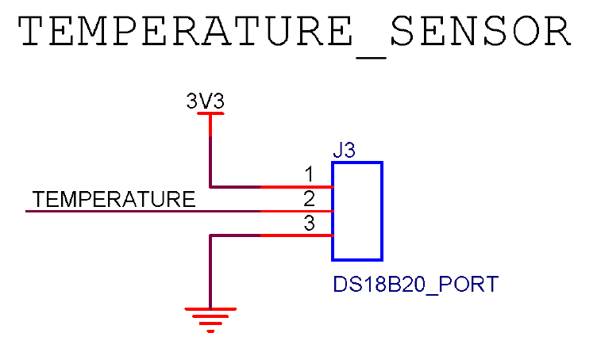

# 温度传感器设计  

## 修改历史  
|版本|日期|说明|作者|  
|----|----|----|----|  
|V1.0|2022年4月10日|创建温度传感器设计|綦浩楠|  
|V1.1|2022年4月11日|添加设计需求，DS18B20相关内容和设计|马博阳|  

## 设计需求  
1. 供电电压：3.3V或5V直流供电；  
2. 测温范围：0 - 60℃；  
3. 测量精度：误差不大于±0.5℃；  
4. 可以在浴室环境下正常工作。  

## 温度传感器方案选择  
`DS18B20`数字温度计提供9位至12位摄氏温度测量，并具有报警功能，具有非易失性用户可编程的上下触发点。`DS18B20`通过1-Wire总线进行通信。根据定义，该总线只需要一根数据线（和地线）即可与中央微处理器通信。它的工作温度范围为 -55 - 125℃，在-10 - 70℃的范围内精确到±0.4℃。价格6元。  
优点：使用简单，精确度高。  
缺点：防水探头15元以上，价格较高；温度响应速度慢。  
本项目对于温度响应速度要求不高，考虑到电路实现的简便，防水探头的价格也在可以接受的范围内。  
  

## 温度传感器设计  
使用`DS18B20`，电路设计只需要提供电源，并将数据线与单片机连接即可。  

