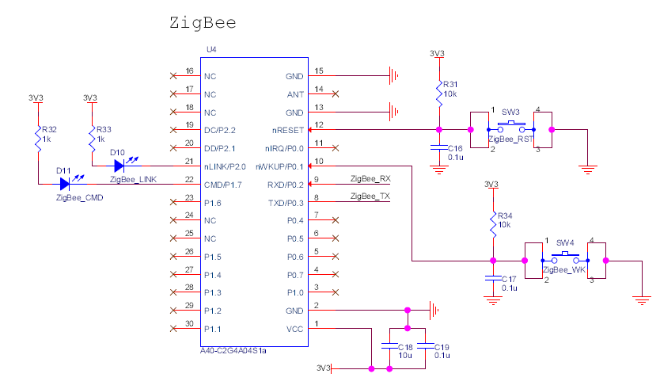

# ZigBee通信协议设计  

## 修改历史  
|版本|日期|说明|作者|  
|----|----|----|----|  
|V1.0|2022年4月10日|创建ZigBee通信协议设计|马博阳|  
|V1.1|2022年4月11日|添加传输流程和响应机制，更正结束标识符占用位数，修改状态信息位数|马博阳|  
|V1.2|2022年4月12日|修改响应帧格式|马博阳|  
|V1.3|2022年4月20日|添加具体器件和原理图|马博阳|  
|V1.4|2022年5月22日|修改协议日期时间部分|马博阳|  

## 通信对象  
淋浴器终端和淋浴间主机  

## 拓扑结构  
淋浴器终端使用ZigBee终端设备，淋浴间主机使用ZigBee协调器。由淋浴间主机的ZigBee模块启动整个网络，建立起星型拓扑结构。  

## 通信协议  
### 传输流程  
发送方发送数据；接收方接收成功发送成功响应，接收方接收错误发送失败响应；发送方接收到成功响应发送成功响应，结束传输，发送方接收到错误响应重发数据，第二次传输仍失败停止传输并报故障。  

### 响应帧格式  
- 成功响应：  
    - `A`  
    - 1字节设备编号：终端发送时为终端的编号；主机发送时为目标终端号（全0为广播）  
    - 1字节结束标志符：$  
- 失败响应：  
    - `N`  
    - 1字节设备编号：终端发送时为终端的编号；主机发送时为目标终端号（全0为广播）  
    - 1字节结束标志符：$  

### 数据帧格式  
- 1字节消息类型：S，终端发送的消息；H，主机发送的消息；E，紧急消息  
- 1字节设备编号：终端发送时为终端的编号；主机发送时为目标终端号（全0为广播）  
- 4字节用户编号：终端发送时为NFC卡号；主机发送时为用户号/学号（全0表示无信息/此卡已挂失）  
- 4字节当前日期  
- 4字节当前时间  
- 4字节当前水温，紧急消息不包含  
- 4字节当前流量，紧急消息不包含  
- 4字节当前余额，紧急消息不包含  
- 2字节状态信息：具体表示见下节  
- 2字节是否设置：某一位为0表示不设置对应状态位，某一位为1表示设置对应状态位  
- 1字节结束标志符：$  

### 状态信息  
|15 - 9|8|7|6|5|4|3|2|1|0|  
|:-:|:-:|:-:|:-:|:-:|:-:|:-:|:-:|:-:|:-:|  
|无效位|是否停供水|是否故障|是否预约|是否正在使用|是否遗落物品|是否第一次刷卡|是否取卡|是否求助|是否报修|  

## 电路设计  
### 器件选择  
选用成都泽耀科技有限公司的ZigBee模块`A40-C2G4A04S1a`，该模块使用TI公司的`CC2530`芯片，可以实现自组网，每个模块都可配置为协调器、路由器和终端。该模块使用镀金半孔引脚，可直接焊接在PCB板上。  
  

### 原理图设计  
按照模块数据手册推荐电路进行设计。  
  
