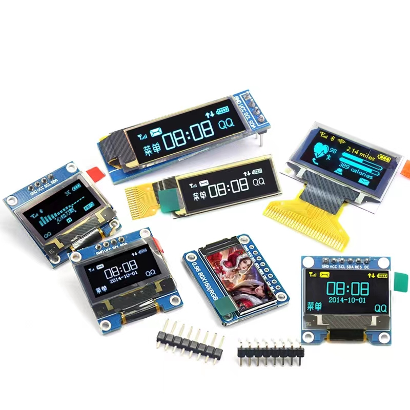
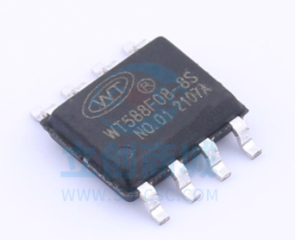
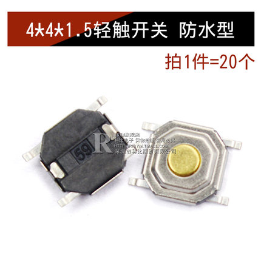
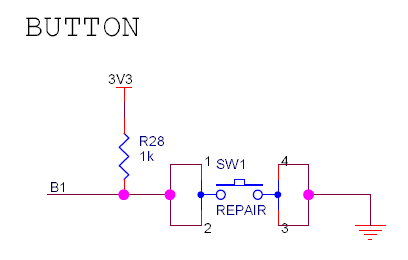

# 人机接口电路设计  

## 修改历史  
|版本|日期|说明|作者|  
|----|----|----|----|  
|V1.0|2022年4月20日|创建人机接口电路设计|马博阳|  

## 设计需求  
1. 供电电压：3.3V或5V直流供电；  
2. 实现显示、播放音频、按键和识别NFC卡片等功能。  

## 器件选择  
人机接口直接选择相应模块或芯片。  
- 显示屏：0.91寸LCD显示屏模块，3.3V供电，IIC接口；  
  
- 扬声器：内置Flash的语音芯片`WT588F08A-8S`，通过串口控制和写入数据，可直接驱动扬声器；  
  
  
- 按钮：微动开关+按键帽+防水套。  
  
  

## 原理图设计  
大部分模块只需要设计接口，扬声器和按钮需要设计驱动电路。  
  
扬声器模块通过音频芯片驱动扬声器，音频芯片需要3.3V供电，直接与单片机交互，输出可以直接驱动阻抗8Ω功率0.5W的扬声器，并增设指示灯。  
  
按钮采用上拉方式，以其中一个为例。  
  
