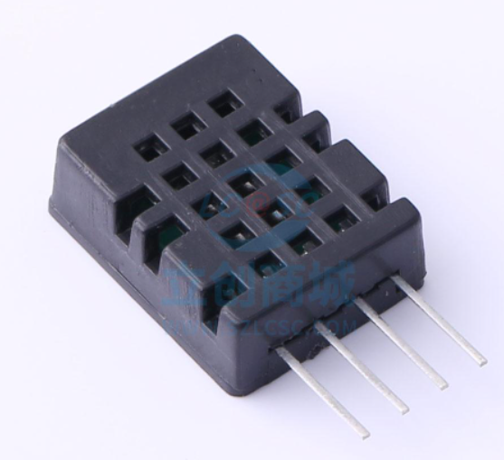

# 湿度传感器设计  

## 修改历史  
|版本|日期|说明|作者|  
|----|----|----|----|  
|V1.0|2022年4月9日|创建湿度传感器设计|马博阳|  
|V1.1|2022年4月11日|修改设计方案为数字温湿度模块|马博阳|  
|V1.2|2022年4月12日|修改设计方案温度范围|马博阳|  
|V1.3|2022年4月20日|修改原理图|马博阳|  

## 设计需求  
1. 供电电压：3.3V或5V直流供电；  
2. 湿度精确度：误差不大于±5%rH；  
3. 湿度测量范围：10% - 90%rH；  
4. 温度精确度：误差不大于±0.5℃；  
5. 温度测量范围：0 - 60℃；  
6. 可以在浴室环境下正常工作。  

## 温湿度传感器方案选择  
数字温湿度传感模块`DHT21`是采用高稳定性电容式感湿元件作为传感元件，经过微处理器采集处理转化成数字信号输出。每一个传感器都经过标定校准和测试。具有长期稳定、可靠性高、精度高、低功耗等特点[^1]。使用3.3V供电，单总线输出，可直接连接单片机。相对湿度在10% - 90%rH的误差不大于±4%rH，温度在10 - 50℃范围内不大于±0.4℃，满足需求。  
  

## 温湿度传感器设计  
使用`DHT21`，电路设计只需要提供电源，并将数据线与单片机连接即可。  
  

[^1]: 广州海谷电子科技有限公司,DHT21产品手册  
