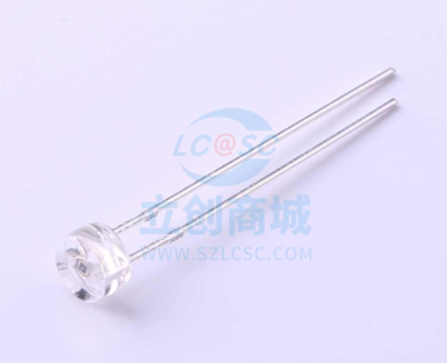

# 光照传感器设计  

## 修改历史  
|版本|日期|说明|作者|  
|----|----|----|----|  
|V1.0|2022年4月12日|创建光照传感器设计|马博阳|  
|V1.1|2022年4月13日|添加滤波和反相处理电路|马博阳|  

## 设计需求  
1. 供电电压：3.3V或5V直流供电；  
2. 可以在浴室环境下正常工作。  

## 光照传感器方案选择  

### 光敏电阻  
在没有光照时，电阻很大；在一定波长范围的光照下，电阻值明显变小。  

### 光电二极管  
光电二极管结构和普通二极管类似，只是结面积比普通二极管大，便于接收光线。光电二极管在反向电压下工作的。它的暗电流很小，在光线照射下产生载流子，它们参加导电会增大反向饱和电流。载流子的数量与光强度有关，因此，反向饱和电流会随着光强的变化而变化，从而可以把光信号的变化转为电流及电压的变化。  

### 光电三极管  
光电三极管结构和普通三极管类似，但基极未引出，且面积较大，可以接收光线。光照时可产生基极电流，集电极产生放大后的基极电流。光电三极管与光电二极管类似，只是经过放大电流更大，更为敏感。  

### 对比和选择  
光敏电阻对于光强的变化不敏感，判断精度差；光电二极管电流较小不方便处理，采用光电三极管。  
  

## 光照传感器设计  
先将三极管的电流信号转换为合适的电压信号，根据数据手册光电流在10流明时最小为$5\mu A$，在100流明时最大为$100\mu A$，设置电阻$R_f$为$10k\Omega$，则$V=-I \times R_f$，，此时为负电压，需要后级处理便于ADC采样和量化。运算放大器选择了5V电压下可用的轨到轨运放。滤波和反相处理电路同红外接收电路。  
  
