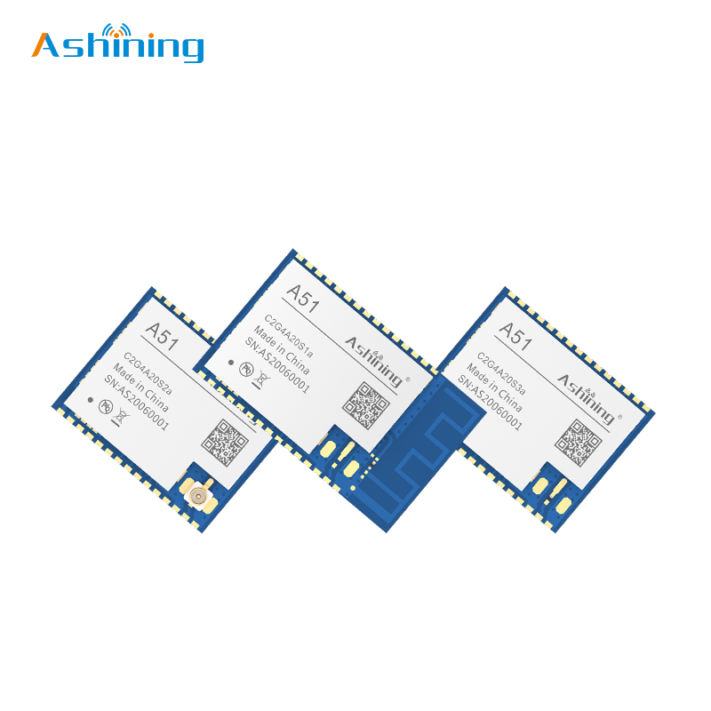
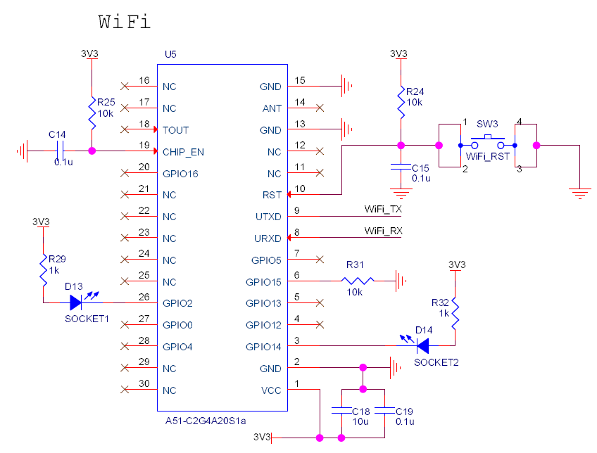

# WiFi通信协议设计  

## 修改历史  
|版本|日期|说明|作者|  
|----|----|----|----|  
|V1.0|2022年4月10日|创建WiFi通信协议设计|马博阳|  
|V1.1|2022年4月11日|添加传输流程和响应机制，更正结束标识符占用位数，修改状态信息位数|马博阳|  
|V1.2|2022年4月12日|修改响应帧格式|马博阳|  
|V1.3|2022年4月20日|添加具体器件和原理图|马博阳|  

## 通信对象  
淋浴间主机和云平台  

## 拓扑结构  
淋浴间主机连接WiFi接入互联网  

## 通信协议  

### 传输流程  
发送方发送数据；接收方接收成功发送成功响应，接收方接收错误发送失败响应；发送方接收到成功响应发送成功响应，结束传输，发送方接收到错误响应重发数据，第二次传输仍失败停止传输并报故障。  

### 响应帧格式  
- 成功响应：  
    - `A`  
    - 1字节设备编号：终端发送时为终端的编号；主机发送时为目标终端号（全0为广播）  
    - 1字节结束标志符：@  
- 失败响应：  
    - `N`  
    - 1字节设备编号：终端发送时为终端的编号；主机发送时为目标终端号（全0为广播）  
    - 1字节结束标志符：@  

### 数据帧格式  
- 1字节消息类型：H，主机发送的消息；C，云平台发送的消息；E，紧急消息  
- 1字节设备编号：主机发送时为主机的编号；云平台发送时为目标主机号（全0为广播）  
- 4字节当前时间  
- 4字节浴室温度，紧急消息不包含  
- 4字节浴室湿度，紧急消息不包含  
- 4字节浴室光照，紧急消息不包含  
- 1字节浴室状态信息：具体表示见下节  
- 1字节是否设置：某一位为0表示不设置对应状态位，某一位为1表示设置对应状态位  
- 1字节需要发送的终端数据个数N，但最多支持16个设备  
- N * 27字节终端数据：ZigBee接收数据的合并  
- 1字节结束标志符：@  

### 状态信息  
|7 - 5|4|3|2|1|0|  
|:-:|:-:|:-:|:-:|:-:|:-:|  
|无效位|是否通风|是否照明|是否停供水|是否报修|是否求助|  

## 电路设计  
### 器件选择  
选用成都泽耀科技有限公司的WiFi模块`A51-C2G4A20S1a`，该模块为2.4G频段，基于乐鑫`ESP8266EX`为核心处理器。支持AT、TCP/UDP、MQTT等模式，可配置为STATION或AP。该模块使用镀金半孔引脚，可直接焊接在PCB板上。  
  

### 原理图设计  
按照模块数据手册推荐电路进行设计。  
  
